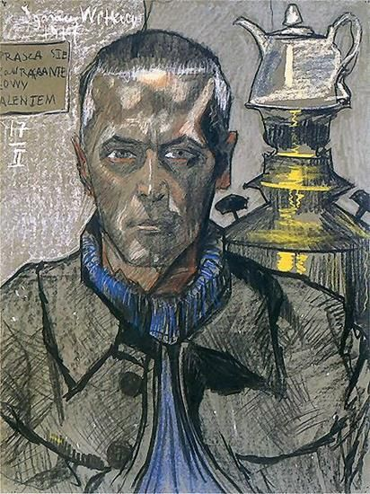
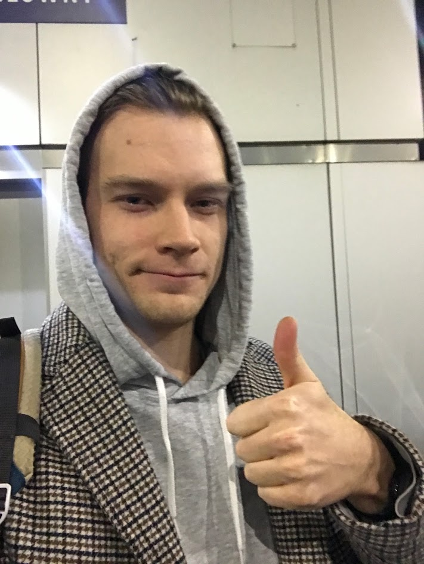
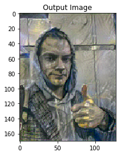

Witkacy's style transfer project
=======

## Goal

Stworzenie aplikacji mającej na celu przeniesienie stylu artysty na dowolny obraz dostarczony przez użytkownika wraz z wyborem konkretnej kategorii oraz substancji. 

## Description

### Synopsis

**Stanisław Ignacy Witkiewicz** - polski pisarz, malarz, filozof, dramaturg i fotografik.

Eksperymentował z substancjami psychoaktywnymi - odkrył ich stymulujący wpływ na wyobraźnię i powiększenie możliwości artystycznych. Tworzył portrety kilentów, jednocześnie będąc pod ich wpływem. Prace badawcze z substancjami takimi jak kokaina, pejotl i syntetyczna meskalina, eter czy zwykły alkohol kontynuował też i później, skrupulatnie notując na obrazach rodzaj użytej substancji. Nie przyjmował żadnego z nich w sposób ciągły i nic nie wskazuje na to, że był od któregokolwiek (z wyjątkiem tytoniu) uzależniony.

### Typy portretów

#### Kategorie

- T.A. - rodzaj stosunkowo najbardziej tzw. "wylizany". Odpowiedni raczej dla twarzy kobiecych, niż męskich. (...) [350 zł]
- T.B. - rodzaj bardziej charakterystyczny, jednak bez cienia karykatury. (...) [250 zł]  
- T.B.+d. - spotęgowanie charakteru, graniczące z pewną karykaturalnością.(...) [150 zł]  
- T.C, C+Co, Et, C+Co+Et, itp. - typy te wykonywane przy pomocy C2H5OH i narkotyków wyższego rzędu - obecnie wykluczone. Charakterystyka modela subiektywna - spotęgowania karykaturalne tak formalne jak i psychologiczne nie wykluczone. W granicy kompozycja abstrakcyjna, czyli tzw. "Czysta Forma. [bez ceny]
- T.D. - to samo osiągnięte bez żadnych sztucznych środków. [100 zł]
- T.E i jego kombinacje z poprzednimi rodzajami. Dowolna interpretacja psychologiczna, według intuicji firmy. (...) [150-250 zł]
- T.B+E (tzw. dziecinny) - Z powodu ruchliwości dzieci czysty T.B. jest przeważnie niemożliwy (...) [150-250 zł] 
- T.U - upadek talentu twórcy  

#### Substancje

- C - alkohol
- Co - kokaina
- Cof - kofeina
- Cryog - cryogenina
- Et - eter
- Eu - eukodal
- Ępedete - un peu de thé (fr.) trochę herbaty
- F.ZZ. - fajka z zaciąganiem się
- Har - harmina
- her - herbata
- m - miesiąc
- m.p. - manu propria (łac.) ręką własną
- Mesk. Merck - meskalina firmy Merck
- N - nie pił alkoholu (towarzyszące liczby określają ilość dni lub miesięcy)
- Napa - na pamięć
- Napafot - na pamięć, z fotografii
- NP - nie palił papierosów (towarzyszące liczby określają ilość dni lub miesięcy)
- P - palił papierosy
- ppc - prawie po ciemku
- r - razy, rok
 
## Features

- podgląd na przyładzie w małej rozdzielczośći jak wyglądają dane typu obrazów (lub ich kombinacje), bez koniecznośći wysyłki na serwer i czekania na odpowiedź
- możliwośc wyboru kategorii i substancji lub ich kombinacji i wgrania własnego portretu/dowolnego zdjęcia
- galeria wszystkich/najlepszych zdjęć po 'style transfer' 
- stopniowe powiększanie bazy danych o kolejne obrazy, tak aby finalnie wszystkie opcje były dostępne (najpierw testy z najczęściej występującymi kategorami)

## Tasks

- ~~write description and this readme~~
- translate readme to eng
- gather first dataset of images
- label the dataset
- ~~create notebook with protype~~
- much, much more ...

## Sources

* https://pl.wikipedia.org/wiki/Stanis%C5%82aw_Ignacy_Witkiewicz
* https://witkacologia.eu/
* http://www.witkacy.hg.pl/
* https://www.muzeum.slupsk.pl/index.php/witkacy/skroty
* https://pytorch.org/tutorials/advanced/neural_style_tutorial.html